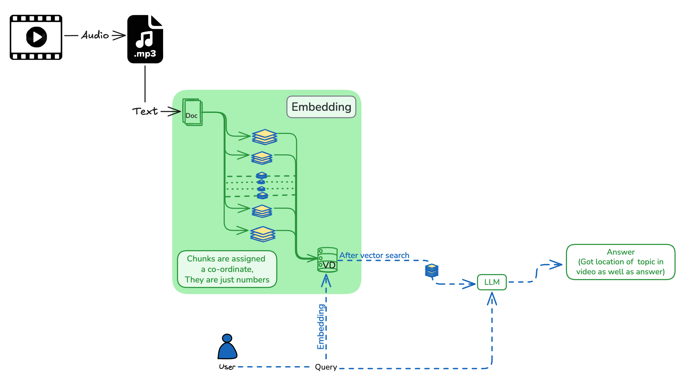

# RAG-Based Question Answering System for Navigating Recorded Lectures

A RAG (Retrieval-Augmented Generation) AI teaching assistant that helps students navigate video course content by answering questions and directing them to specific video timestamps. The system processes video lectures, transcribes them, creates semantic embeddings, and uses similarity search to find relevant content for user queries.

## Features

* **Video Processing Pipeline:** Automatically converts video files to audio and transcribes them using OpenAI Whisper
* **Semantic Search:** Uses embeddings (via Ollama's bge-m3 model) to find the most relevant video chunks for any question
* **Intelligent Q&A:** Leverages LLM (Llama 3.2) to provide natural language answers with specific video references and timestamps
* **Course-Specific Context:** Tailored for Investment Banking courses but adaptable to any video-based educational content
* **Timestamp Navigation:** Directs users to exact moments in videos where relevant content is discussed

## Technologies Used

* **Python 3.x** - Core programming language
* **FFmpeg** - Video to audio conversion
* **OpenAI Whisper** - Speech-to-text transcription (large-v2 model)
* **Ollama** - Embedding generation (bge-m3) and LLM inference (llama3.2)
* **pandas & numpy** - Data manipulation and processing
* **scikit-learn** - Cosine similarity calculations
* **joblib** - Efficient storage of embeddings

## Installation

### Prerequisites

1. **Python 3.8+** installed on your system
2. **FFmpeg** installed and accessible in your PATH:

3. **Ollama** installed and running locally:

### Setup

1. Clone or download this repository:

2. Install Python dependencies:

3. Create required directories:


## Usage

### Step 1: Collect Your Videos

Place all your video course files in the `videos/` directory.

### Step 2: Convert Videos to MP3

Run the video conversion script:
```bash
python videos_to_mp3.py
```

This will convert all videos in `videos/` to MP3 format and save them in `audios/`.

### Step 3: Transcribe MP3 Files to JSON

Process audio files to extract transcripts:
```bash
python mp3_to_text.py
```

**Note:** Update the paths in `mp3_to_text.py` to match your directory structure:
```python
audio_dir = "[your-audio-directory-path]"
jsons_dir = "[your-json-output-directory-path]"
```

This creates JSON files in `jsons/` containing transcribed chunks with timestamps.

### Step 4: Create Embeddings

Generate embeddings from transcribed chunks:
```bash
python embeddings_chunks.py
```

Ensure Ollama is running (`ollama serve`) and the `bge-m3` model is available. This script:
- Processes all JSON files in `jsons/`
- Creates embeddings for each text chunk
- Saves the results to `embeddings.joblib`

### Step 5: Query the System

Run the main query processing script:
```bash
python process_incoming.py
```

When prompted, enter your question:
```
Ask a Question: [your-question-about-the-course]
```

The system will:
1. Find the top 5 most relevant video chunks using cosine similarity
2. Generate a contextual prompt with the relevant chunks
3. Query the LLM for a natural language response
4. Display the answer with video references and timestamps
5. Save the prompt to `prompt.txt` and response to `response.txt`



## Examples

### Example Query Workflow

```bash
$ python process_incoming.py
Ask a Question: What is discounted cash flow?
```

**System Response:**
> Discounted cash flow (DCF) is covered in Video V1 at multiple timestamps. The concept is introduced around 5:16 (314 seconds) where it's described as "the best way to understand discounted cash flows." The model is explained starting at 4:10 (250 seconds) as "the discounted cash flow model, where we are technically reducing the..." For a complete understanding, watch Video V1 from timestamp 4:10 to 7:12.

### Configuration Example

To customize for your course, update the prompt template in `process_incoming.py`:

```python
prompt = f'''I am teaching [Your Course Name] in my course. Here are video subtitle chunks...
```

## Project Structure

```
finding_location_contents/
├── videos/              # Input video files
├── audios/              # Converted MP3 audio files
├── jsons/               # Transcribed JSON files with chunks
├── videos_to_mp3.py     # Video to audio conversion script
├── mp3_to_text.py       # Audio transcription script
├── embeddings_chunks.py # Embedding generation script
├── process_incoming.py  # Main query processing script
├── embeddings.joblib    # Saved embeddings database
├── prompt.txt           # Generated prompt (for debugging)
└── README.md            # This file
```

## Requirements

* Python 3.8+
* FFmpeg
* Ollama (with bge-m3 and llama3.2 models)
* openai-whisper
* pandas
* numpy
* scikit-learn
* joblib
* requests

## Notes

* **Ollama Server:** Ensure Ollama is running locally on `http://localhost:11434` before running embedding or query scripts
* **Model Selection:** You can modify the models in the scripts:
  - Embedding model: Change `"model": "bge-m3"` in `create_embedding()` functions
  - LLM model: Change `"model": "llama3.2"` in `inference()` function
* **Language Support:** The transcription defaults to English. Modify `language="english"` in `mp3_to_text.py` for other languages
* **Performance:** Large video files may take significant time to process. Consider processing in batches for extensive course libraries


## Support

For issues, questions, or contributions, please open an issue on the repository or contact me on LinkedIn.


**Note:** This project uses local models via Ollama and does not require external API keys. Ensure Ollama is properly installed and configured before use.

